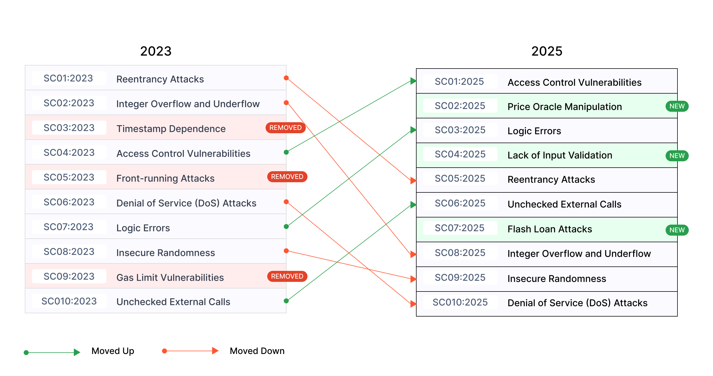
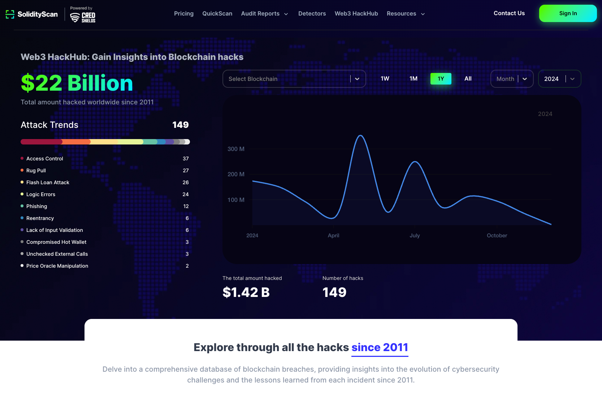

---

layout: col-sidebar
title: OWASP Smart Contract Top 10
tags: smartcontract
level: 2
type: documentation
pitch: Welcome to the OWASP Top Ten for Smart Contracts

---

## スマートコントラクト Top 10 について

OWASP スマートコントラクト Top 10 (2025) は、Web3 開発者とセキュリティチームにスマートコントラクトで発見された上位 10 の脆弱性についての洞察を提供する標準的な案内ドキュメントです。

これは、近年悪用されたり発見された最も重大な弱点に対してスマートコントラクトが保護されていることを確保するための参考情報として機能します。**スマートコントラクト Top 10** を他のスマートコントラクトセキュリティプロジェクトと併用することで、包括的なリスクカバレッジを確保できます。OWASP スマートコントラクトセキュリティプロジェクトの詳細については [scs.owasp.org](https://scs.owasp.org/) をご覧ください。

## 変更内容

### Top 10

* SC01:2025 - [アクセス制御の脆弱性 (Access Control Vulnerabilities)](2025/en/src/SC01-access-control.md)
* SC02:2025 - [価格オラクル操作 (Price Oracle Manipulation)](2025/en/src/SC02-price-oracle-manipulation.md)
* SC03:2025 - [ロジックエラー (Logic Errors)](2025/en/src/SC03-logic-errors.md)
* SC04:2025 - [入力バリデーションの欠如 (Lack of Input Validation)](2025/en/src/SC04-lack-of-input-validation.md)
* SC05:2025 - [再入可能性攻撃 (Reentrancy Attacks)](2025/en/src/SC05-reentrancy-attacks.md)
* SC06:2025 - [チェックされていない外部呼び出し (Unchecked External Calls)](2025/en/src/SC06-unchecked-external-calls.md)
* SC07:2025 - [フラッシュローン攻撃 (Flash Loan Attacks)](2025/en/src/SC07-flash-loan-attacks.md)
* SC08:2025 - [整数オーバーフローとアンダーフロー (Integer Overflow and Underflow)](2025/en/src/SC08-integer-overflow-underflow.md)
* SC09:2025 - [安全でないランダム性 (Insecure Randomness)](2025/en/src/SC09-insecure-randomness.md)
* SC10:2025 - [サービス拒否 (DoS) 攻撃 (Denial of Service (DoS) Attacks)](2025/en/src/SC10-denial-of-service.md)

### 概要

| タイトル | 説明 |
| -- | -- |
| SC01 - アクセス制御の脆弱性 (Access Control Vulnerabilities) | アクセス制御の欠陥は、認可されていないユーザーがコントラクトのデータや機能にアクセスしたり変更することを可能にします。このような脆弱性は、コードが適切な権限チェックを実施しない場合に発生し、深刻なセキュリティ侵害につながる可能性があります。 |
| SC02 - 価格オラクル操作 (Price Oracle Manipulation) | 価格オラクル操作は、スマートコントラクトが外部データを取得する方法についての脆弱性を悪用します。オラクルフィードを改竄したり制御することで、攻撃者はコントラクトロジックに影響を及ぼし、金銭的損失やシステムの不安定化を招く可能性があります。 |
| SC03 - ロジックエラー (Logic Errors) | ロジックエラー、つまりビジネスロジックの脆弱性は、コントラクトの動作が意図した機能から逸脱する場合に発生します。例としては、報酬分配の誤り、トークン鋳造の問題、貸借ロジックの欠陥などがあります。 |
| SC04 - 入力バリデーションの欠如 (Lack of Input Validation) | 入力バリデーションが不十分だと、攻撃者が有害な入力や予期しない入力を提供することでコントラクトを操作し、ロジックを破壊したり予期しない動作を引き起こす脆弱性につながる可能性があります。 |
| SC05 - 再入攻撃 (Reentrancy Attacks) | 再入攻撃は、脆弱な関数の実行を完了する前にその関数に再入する能力を悪用します。これは繰り返し状態を変更し、コントラクト資金を枯渇したりロジックを破壊することにつながることがよくあります。 |
| SC06 - チェックされていない外部呼び出し (Unchecked External Calls) | 外部関数呼び出しの成功を検証しないと、意図しない結果を招く可能性があります。呼び出されたコントラクトが失敗すると、呼び出したコントラクトが誤って続行し、完全性と機能性を損なう可能性があります。 |
| SC07 - フラッシュローン攻撃 (Flash Loan Attacks) | フラッシュローンは便利ですが、単一のトランザクションで複数のアクションを実行することで、プロトコルを操作するために悪用される可能性があります。このような攻撃は流動性の枯渇、価格の改変、ビジネスロジックの悪用につながることがよくあります。 |
| SC08 - 整数オーバーフローとアンダーフロー (Integer Overflow and Underflow) | 固定サイズ整数の制限を超えることによる算術エラーは、計算の誤りやトークンの窃取などの重大な脆弱性につながる可能性があります。符号なし整数はアンダーフローでラップアラウンドしますが、符号付き整数は両極端の間でフリップします。 |
| SC09 - 安全でないランダム性 (Insecure Randomness) | ブロックチェーンネットワークの決定論的な性質により、安全なランダム性を生成することは困難です。予測可能または操作可能なランダム性は、宝くじ、トークン配布、その他のランダム性に依存する機能での悪用につながる可能性があります。 |
| SC10 - サービス拒否 (DoS) 攻撃 (Denial of Service (DoS) Attacks) | DoS 攻撃は脆弱性を悪用してコントラクトリソースを使い果たし、コントラクトを機能不能にします。例としては、ループでの過剰なガス消費や、通常のコントラクト操作の妨害するように設計された関数呼び出しなどがあります。 |

## データソース

### SolidityScan の Web3HackHub:

OWASP スマートコントラクト Top 10 脆弱性を特定して検証するために、複数の信頼できるソースからの洞察を取り入れ、特に **[SolidityScan の Web3HackHub](https://solidityscan.com/web3hackhub?year=2024) (2024)** に注目しました。このリソースは、ブロックチェーン関連のインシデントの包括的なデータベースを提供し、攻撃ベクトル、金銭的損失、傾向に関する貴重なデータを提供します。

Web3HackHub は 2011 年以降の侵害を記録しており、進化する攻撃方法、巧妙化するエクスプロイト、各インシデントから得られた教訓を分析できます。

**2024 年の Web3HackHub の主なハイライトは以下のとおりです:**

- 金銭的影響の総額: 2024 年に記録された 149 件のインシデントで 14 億 2 千万ドルの損失。

- 上位の攻撃ベクトル (頻度別、損失総額):
    - アクセス制御の脆弱性 (Access Control Vulnerabilities): 9 億 5,320 万ドルの損失。
    - ロジックエラー (Logic Errors): 6,380 万ドルの損失。
    - 再入攻撃 (Reentrancy Attacks): 3,570 万ドルの損失。
    - フラッシュローン攻撃 (Flash Loan Attacks): 3,380 万ドルの損失。
    - 入力バリデーションの欠如 (Lack of Input Validation): 1,460 万ドルの損失。
    - 価格オラクル操作 (Price Oracle Manipulation): 880 万ドルの損失。
    - チェックされていない外部呼び出し (Unchecked External Calls): 55 万 7 千ドルの損失。

### 他のソース:

SolidityScan の Web3HackHub に加えて、[Peter Kacherginsky の "Top 10 DeFi Attack Vectors - 2024"](https://x.com/_iphelix/status/1855855006219690233) からの洞察を取り入れることで、2025 年の OWASP スマートコントラクト Top 10 を作成するための貴重なデータを得られます。Peter の分析は、進化する脅威の状況を理解し、OWASP スマートコントラクト Top 10 を実際の観測と整合する上で役に立ちます。

SolidityScan の Web3HackHub と Kacherginsky の "Top 10 DeFi Attack Vectors - 2024" の両方のデータを統合することで、2025 年のランキングに包括的な根拠を提供できました。

**149 security incidents from SolidityScan の Web3HackHub (2024) の149 件のセキュリティインシデント**、**Peter Kacherginsky の "Top 10 DeFi Attack Vectors - 2024"**、**[Immunefi Crypto Losses in 2024 Report](https://downloads.ctfassets.net/t3wqy70tc3bv/2LqNkvjajiCS5sPJmWLakc/9715af967dd95a55da05d2ad373edb0d/Immunefi_Crypto_Losses_in_2024_Report.pdf)** を分析すると、**分散エコシステム全体で 14 億 2 千万ドル以上の金銭的損失** を記録し、ブロックチェーンとスマートコントラクトエコシステムにおける最も重大な脆弱性に対処するために **OWASP スマートコントラクト Top 10 2025** が作成されました。

## ライセンス
The OWASP Smart Contract Top 10 (2025) is licensed under the [CC BY-NC-SA 4.0](https://creativecommons.org/licenses/by-nc-sa/4.0/), the Creative Commons Attribution-ShareAlike 4.0 license. Some rights reserved.

## プロジェクトリーダー
- [Jinson Varghese Behanan](mailto:jinson@owasp.org) (Twitter: [@JinsonCyberSec](https://x.com/JinsonCyberSec))
- [Shashank](mailto:shashank@credshields.com) (Twitter: [@cyberboyIndia](https://x.com/cyberboyIndia))
